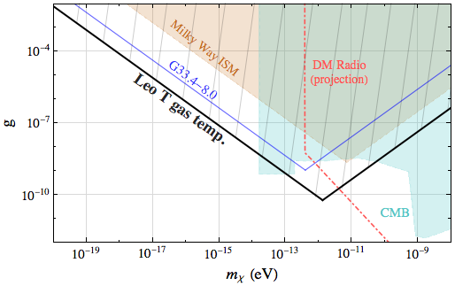

# Code for using gas-rich dwarf galaxies as powerful dark matter detectors

Code repository associated with the paper [arXiv:1903.12190](https://arxiv.org/abs/1903.12190) [Wadekar & Farrar 19]
and the paper [arXiv:1903.12190](https://arxiv.org/abs/1903.12190) [Wadekar & Wang 21]

1. Paper_Plots.nb contains the code and links to data files for the plots in the paper.

2. CalculationDetails.nb contains the calculations in the paper for various dark matter models.

Author: Digvijay Wadekar

with major input from Zihui Wang

If you are interested in more details about a particular part of the calculation, please feel free to email me at: jayw@ias.edu

### Additional notes
Some material relevant to the paper [arXiv:1903.12191](https://arxiv.org/abs/1903.12190) is also present.
